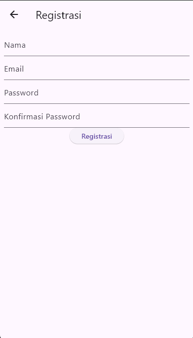
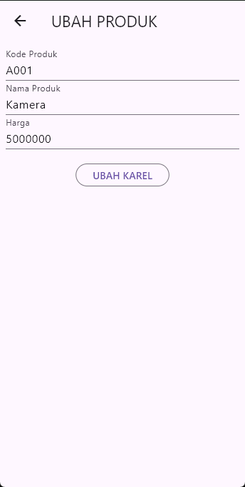
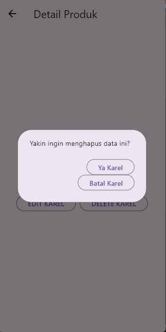

# Toko Kita – Alur Login & CRUD

Project demo Flutter dengan alur registrasi, login, dan CRUD produk berbasis penyimpanan in-memory (lihat `lib/service/app_store.dart`). Default user: `demo@tokokita.com` / `123456`.

## Proses Login

- Isi email & password lalu tekan **Login**.
- Validasi wajib isi; login memanggil `AppStore.instance.login(...)` (`lib/ui/login_page.dart`, `_handleLogin` baris ~53) dan menavigasi ke `ProdukPage` saat sukses.
- Gagal login menampilkan `SnackBar` dengan pesan error.

## Proses Registrasi

- Buka tautan **Registrasi** di layar login.
- Isi nama, email, password, dan konfirmasi lalu tekan **Registrasi**.
- Validasi: nama ≥3, email format benar, password ≥6, konfirmasi harus sama.
- `AppStore.instance.register(user)` menyimpan user baru; sukses menutup halaman dan menampilkan `SnackBar` info (lihat `lib/ui/registrasi_page.dart`, `_handleRegister`).

## Daftar Produk (List)

- Setelah login, tampil daftar produk dari `AppStore` (`lib/ui/produk_page.dart`, `_refreshProduk`).
- AppBar memiliki ikon tambah untuk membuka form produk.
- Drawer menyediakan aksi **Logout** yang menghapus sesi dan kembali ke login.

## Tambah Produk

- Dari list, tap ikon **+** → `ProdukForm` (`lib/ui/produk_form.dart`).
- Field: Kode, Nama, Harga (wajib diisi).
- Tekan **SIMPAN**: form memvalidasi lalu mengembalikan objek `Produk`; `ProdukPage` memanggil `AppStore.instance.addProduk` dan memuat ulang daftar.

## Detail, Ubah, dan Hapus Produk

- Tap salah satu item pada list → `ProdukDetail` (`lib/ui/produk_detail.dart`).
- Tampilkan Kode, Nama, Harga.

### Ubah

- Tekan **EDIT** pada detail untuk membuka `ProdukForm` dengan data terisi.
- Simpan perubahan → `AppStore.instance.updateProduk` dipanggil di `ProdukPage` setelah kembali dari detail.

### Hapus

- Tekan **DELETE** → dialog konfirmasi.
- Pilih **Ya** → `ProdukDetail` mem-pop hasil `{'action': 'delete', 'id': ...}`; `ProdukPage` memanggil `AppStore.instance.deleteProduk` lalu memuat ulang list.

## Ringkasan Kode Inti
- `lib/main.dart`: entry app, memulai di `LoginPage`.
- `lib/service/app_store.dart`: penyimpanan in-memory user & produk, seed data, login/register, add/update/delete produk.
- `lib/ui/login_page.dart`: form login, validasi, SnackBar error, navigasi ke list.
- `lib/ui/registrasi_page.dart`: form registrasi, validasi, simpan user baru.
- `lib/ui/produk_page.dart`: list produk, tambah, terima hasil edit/hapus, logout.
- `lib/ui/produk_form.dart`: form tambah/ubah dengan validasi field.
- `lib/ui/produk_detail.dart`: detail produk, tombol edit & delete dengan dialog konfirmasi.

> Catatan: Data tersimpan hanya di memori proses (tidak ada backend). Restart aplikasi akan me-reset ke seed data.***
