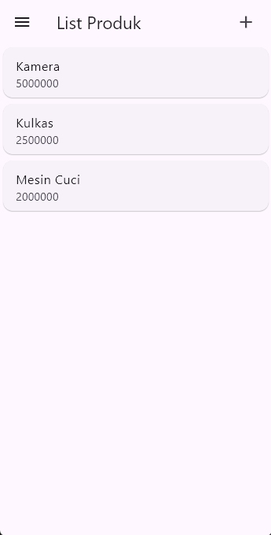
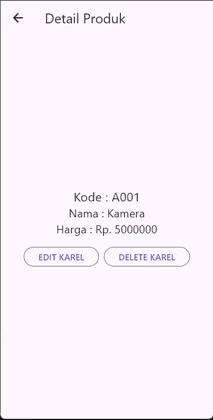
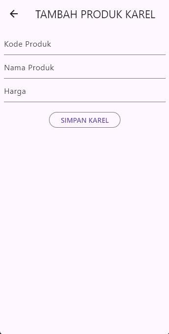

# toko kita

## 1. Halaman List

lib/ui/produk_page.dart (penjelasan per baris, tanpa baris kosong)

- Baris 1: Import paket material Flutter.
- Baris 2: Import model `Produk` sebagai tipe data item.
- Baris 3: Import layar detail produk.
- Baris 4: Import form produk untuk tambah/edit.
- Baris 6: Deklarasi `ProdukPage` sebagai `StatefulWidget`.
- Baris 7: Konstruktor const tanpa argumen tambahan.
- Baris 9: Override `createState`.
- Baris 10: Mengembalikan `_ProdukPageState`.
- Baris 13: Kelas state `_ProdukPageState`.
- Baris 14: List `_produks` berisi data dummy.
- Baris 15: Memulai item pertama objek `Produk`.
- Baris 16: Set id item pertama ke `'1'`.
- Baris 17: Set kode produk pertama ke `A001`.
- Baris 18: Set nama produk pertama ke `Kamera`.
- Baris 19: Set harga produk pertama ke `5000000`.
- Baris 20: Menutup item pertama.
- Baris 21: Memulai item kedua objek `Produk`.
- Baris 22: Set id item kedua ke `'2'`.
- Baris 23: Set kode item kedua ke `A002`.
- Baris 24: Set nama item kedua ke `Kulkas`.
- Baris 25: Set harga item kedua ke `2500000`.
- Baris 26: Menutup item kedua.
- Baris 27: Memulai item ketiga objek `Produk`.
- Baris 28: Set id item ketiga ke `'3'`.
- Baris 29: Set kode item ketiga ke `A003`.
- Baris 30: Set nama item ketiga ke `Mesin Cuci`.
- Baris 31: Set harga item ketiga ke `2000000`.
- Baris 32: Menutup item ketiga.
- Baris 33: Menutup list dummy.
- Baris 35: Override `build`.
- Baris 36: Parameter `BuildContext context`.
- Baris 37: Mengembalikan `Scaffold`.
- Baris 38: Membuka `AppBar`.
- Baris 39: Judul AppBar "List Produk".
- Baris 40: Mulai properti `actions`.
- Baris 41: Padding kanan ikon tambah.
- Baris 42: Padding 20 piksel di kanan.
- Baris 43: GestureDetector membungkus ikon.
- Baris 44: Ikon plus ukuran 26.
- Baris 45: onTap memanggil `_tambahProduk`.
- Baris 46: Menutup GestureDetector.
- Baris 47: Menutup Padding.
- Baris 48: Menutup list actions.
- Baris 49: Menutup AppBar.
- Baris 50: Membuka Drawer.
- Baris 51: Isi Drawer berupa ListView.
- Baris 52: List anak-anak drawer.
- Baris 53: Tambah ListTile.
- Baris 54: Teks menu "Logout KAREL".
- Baris 55: Icon logout di sisi kanan.
- Baris 56: onTap menutup drawer dengan `Navigator.pop`.
- Baris 57: Menutup ListTile.
- Baris 58: Menutup daftar children.
- Baris 59: Menutup ListView.
- Baris 60: Menutup Drawer.
- Baris 61: Membuka body `ListView.builder`.
- Baris 62: `itemCount` sesuai panjang `_produks`.
- Baris 63: Builder dengan context dan index.
- Baris 64: Ambil produk berdasarkan index.
- Baris 65: Return `ItemProduk` dengan produk dan handler tap ke `_bukaDetail`.
- Baris 66: Menutup itemBuilder.
- Baris 67: Menutup ListView.builder.
- Baris 68: Menutup Scaffold.
- Baris 69: Menutup build.
- Baris 71: Fungsi async `_tambahProduk` dimulai.
- Baris 72: Push `ProdukForm` memakai `Navigator.push`.
- Baris 73: Kirim context ke navigator.
- Baris 74: MaterialPageRoute membangun `ProdukForm`.
- Baris 75: Menutup pemanggilan push.
- Baris 77: Cek jika hasil tidak null.
- Baris 78: Masuk setState.
- Baris 79: Jika id kosong, buat id timestamp millis.
- Baris 80: Tambahkan produk baru ke list.
- Baris 81: Menutup setState.
- Baris 82: Menutup if.
- Baris 83: Menutup fungsi `_tambahProduk`.
- Baris 86: Fungsi async `_bukaDetail` dimulai.
- Baris 87: Push ke `ProdukDetail` dengan produk dipilih.
- Baris 88: Kirim context.
- Baris 89: MaterialPageRoute builder ke `ProdukDetail`.
- Baris 90: Menutup push.
- Baris 92: Jika hasil kembali `Produk`.
- Baris 93: setState untuk update list.
- Baris 94: Cari index produk dengan id sama.
- Baris 95: Jika ditemukan.
- Baris 96: Ganti item list dengan produk baru.
- Baris 97: Menutup if index.
- Baris 98: Menutup setState.
- Baris 99: Menutup if result Produk.
- Baris 100: Jika hasil Map dengan action delete, lanjut hapus.
- Baris 101: `removeWhere` berdasarkan id.
- Baris 102: Menutup blok hapus.
- Baris 103: Menutup blok else-if.
- Baris 104: Menutup fungsi `_bukaDetail`.
- Baris 105: Menutup kelas `_ProdukPageState`.
- Baris 107: Deklarasi `ItemProduk` stateless.
- Baris 108: Konstruktor dengan produk dan callback tap.
- Baris 111: Field produk final.
- Baris 112: Field callback `onTap` final.
- Baris 114: Override build widget.
- Baris 115: Parameter context.
- Baris 116: GestureDetector untuk menangkap tap.
- Baris 117: onTap memanggil callback.
- Baris 118: Card membungkus ListTile.
- Baris 119: ListTile menampilkan teks.
- Baris 120: Title menampilkan nama produk atau '-'.
- Baris 121: Subtitle menampilkan harga atau '-'.
- Baris 122: Menutup ListTile.
- Baris 123: Menutup Card.
- Baris 124: Menutup GestureDetector.
- Baris 125: Menutup build.
- Baris 126: Menutup kelas `ItemProduk`.

## 2. Halaman Detail

lib/ui/produk_detail.dart (penjelasan per baris, tanpa baris kosong)

- Baris 1: Import paket material.
- Baris 2: Import model `Produk`.
- Baris 3: Import form produk untuk edit.
- Baris 5: Deklarasi `ProdukDetail` sebagai `StatefulWidget`.
- Baris 6: Konstruktor menerima produk yang akan ditampilkan.
- Baris 8: Field final `produk`.
- Baris 10: Override `createState`.
- Baris 11: Mengembalikan `_ProdukDetailState`.
- Baris 14: Kelas state `_ProdukDetailState`.
- Baris 16: Override `build`.
- Baris 17: Kembalikan `Scaffold`.
- Baris 18: AppBar dimulai.
- Baris 19: Judul AppBar "Detail Produk".
- Baris 20: Menutup AppBar.
- Baris 21: Body `Center`.
- Baris 22: Kolom konten detail.
- Baris 23: Kolom ukuran minimal.
- Baris 25: Teks kode produk dengan prefix "Kode :".
- Baris 26: Mengambil `kodeProduk` atau '-'.
- Baris 27: Style font size 20.
- Baris 29: Teks nama produk dengan prefix "Nama :".
- Baris 30: Mengambil `namaProduk` atau '-'.
- Baris 31: Style font size 18.
- Baris 33: Teks harga produk dengan prefix "Harga : Rp.".
- Baris 34: Mengambil `hargaProduk` atau '-'.
- Baris 35: Style font size 18.
- Baris 37: SizedBox tinggi 16 sebagai jarak.
- Baris 38: Memanggil widget tombol edit/hapus.
- Baris 40: Menutup kolom.
- Baris 41: Menutup Center.
- Baris 42: Menutup body.
- Baris 43: Menutup Scaffold.
- Baris 45: Fungsi `_tombolHapusEdit` dimulai.
- Baris 46: Row mainAxisSize min.
- Baris 49: Tombol outline "EDIT KAREL".
- Baris 50: Label tombol.
- Baris 51: onPressed memanggil `_editProduk`.
- Baris 53: SizedBox lebar 8 sebagai jarak tombol.
- Baris 54: Tombol outline "DELETE KAREL".
- Baris 55: Label tombol.
- Baris 56: onPressed memanggil `_confirmHapus`.
- Baris 58: Menutup Row.
- Baris 60: Menutup widget tombol.
- Baris 62: Fungsi async `_editProduk`.
- Baris 63: Navigator.push ke `ProdukForm`.
- Baris 64: Kirim context.
- Baris 65: MaterialPageRoute builder.
- Baris 66: Builder mengirim produk lama ke form.
- Baris 70: Menutup push.
- Baris 72: Jika hasil tidak null.
- Baris 73: Pop kembali ke halaman sebelumnya dengan produk baru.
- Baris 75: Menutup fungsi `_editProduk`.
- Baris 77: Fungsi `_confirmHapus` dimulai.
- Baris 78: Membuat `AlertDialog`.
- Baris 79: Konten teks konfirmasi.
- Baris 81: Tombol outline "Ya Karel".
- Baris 82: Label tombol.
- Baris 83: onPressed: tutup dialog, lalu pop dengan action delete dan id produk.
- Baris 84: Menutup onPressed.
- Baris 85: Menutup tombol "Ya".
- Baris 88: Tombol outline "Batal Karel".
- Baris 89: Label tombol.
- Baris 90: onPressed menutup dialog.
- Baris 92: Menutup tombol "Batal".
- Baris 93: Menutup actions dialog.
- Baris 95: `showDialog` menampilkan alert.
- Baris 96: Menutup fungsi `_confirmHapus`.
- Baris 97: Menutup kelas `_ProdukDetailState`.

## 3. Halaman Tambah Produk

lib/ui/produk_form.dart (mode tambah; penjelasan per baris, tanpa baris kosong)

- Baris 1: Import paket material.
- Baris 2: Import model `Produk`.
- Baris 4: Deklarasi `ProdukForm` sebagai `StatefulWidget`.
- Baris 5: Konstruktor menerima produk opsional.
- Baris 7: Field produk nullable.
- Baris 9: Override `createState`.
- Baris 10: Mengembalikan `_ProdukFormState`.
- Baris 13: Kelas state `_ProdukFormState`.
- Baris 14: GlobalKey form untuk validasi.
- Baris 15: Flag loading `_isLoading`.
- Baris 17: Judul default "TAMBAH PRODUK KAREL".
- Baris 18: Label tombol default "SIMPAN KAREL".
- Baris 20: Controller untuk kode produk.
- Baris 21: Controller untuk nama produk.
- Baris 22: Controller untuk harga produk.
- Baris 24: Override `initState`.
- Baris 25: Panggil `super.initState()`.
- Baris 27: Panggil `_setUpdateState` untuk cek mode edit.
- Baris 30: Override `dispose`.
- Baris 31: Dispose controller kode.
- Baris 32: Dispose controller nama.
- Baris 33: Dispose controller harga.
- Baris 35: Panggil `super.dispose()`.
- Baris 38: Fungsi `_setUpdateState`.
- Baris 39: Cek apakah `widget.produk` tersedia.
- Baris 40: Jika ada, set judul jadi "UBAH PRODUK".
- Baris 41: Set label tombol jadi "UBAH KAREL".
- Baris 42: Isi controller kode dari produk lama.
- Baris 43: Isi controller nama dari produk lama.
- Baris 44: Isi controller harga dari produk lama.
- Baris 45: Mengambil harga sebagai string atau kosong.
- Baris 49: Override `build`.
- Baris 50: Parameter context.
- Baris 51: Kembalikan `Scaffold`.
- Baris 52: AppBar dengan judul dinamis.
- Baris 53: Body `SingleChildScrollView`.
- Baris 54: Padding 8 piksel.
- Baris 55: Form dengan key `_formKey`.
- Baris 58: Kolom menampung field.
- Baris 60: Panggil `_kodeProdukTextField`.
- Baris 61: Panggil `_namaProdukTextField`.
- Baris 62: Panggil `_hargaProdukTextField`.
- Baris 63: SizedBox tinggi 20.
- Baris 64: Panggil `_buttonSubmit`.
- Baris 70: Menutup build.
- Baris 73: Fungsi `_kodeProdukTextField`.
- Baris 74: Return `TextFormField`.
- Baris 75: InputDecoration label "Kode Produk".
- Baris 76: Keyboard tipe text.
- Baris 77: Controller kode.
- Baris 78: Validator mulai.
- Baris 79: Cek null atau kosong.
- Baris 80: Jika kosong, pesan "Kode Produk harus diisi".
- Baris 82: Jika valid, kembalikan null.
- Baris 85: Menutup widget kode.
- Baris 87: Fungsi `_namaProdukTextField`.
- Baris 88: Return TextFormField.
- Baris 89: Label "Nama Produk".
- Baris 90: Keyboard text.
- Baris 91: Controller nama.
- Baris 92: Validator mulai.
- Baris 93: Cek null atau kosong.
- Baris 94: Jika kosong, pesan "Nama Produk harus diisi".
- Baris 96: Jika valid, null.
- Baris 99: Menutup widget nama.
- Baris 101: Fungsi `_hargaProdukTextField`.
- Baris 102: Return TextFormField.
- Baris 103: Label "Harga".
- Baris 104: Keyboard number.
- Baris 105: Controller harga.
- Baris 106: Validator mulai.
- Baris 107: Cek null atau kosong.
- Baris 108: Jika kosong, pesan "Harga harus diisi".
- Baris 110: Jika valid, null.
- Baris 112: Menutup widget harga.
- Baris 115: Fungsi `_buttonSubmit`.
- Baris 116: Return OutlinedButton.
- Baris 117: onPressed disable jika `_isLoading`, kalau tidak panggil `_handleSubmit`.
- Baris 118: Jika loading tampil SizedBox dengan CircularProgressIndicator.
- Baris 124: Jika tidak loading tampil teks tombol `tombolSubmit`.
- Baris 125: Menutup tombol.
- Baris 128: Fungsi `_handleSubmit`.
- Baris 129: Validasi form; kalau gagal berhenti.
- Baris 130: setState set `_isLoading` true.
- Baris 132: Buat objek `Produk`.
- Baris 133: Isi id dari produk lama jika ada.
- Baris 134: Isi kode dari controller.
- Baris 135: Isi nama dari controller.
- Baris 136: Isi harga dari controller.
- Baris 137: Coba parse harga ke num, jika gagal tetap string asli.
- Baris 140: Pop navigator dan kirim objek produk.
- Baris 142: Menutup fungsi `_handleSubmit`.
- Baris 143: Menutup kelas `_ProdukFormState`.

## 4. Halaman Ubah Produk

Halaman ini memakai file yang sama `lib/ui/produk_form.dart` namun dalam mode edit (produk sudah terisi). Penjelasan baris sudah tercantum pada bagian Tambah Produk; poin spesifik mode ubah:

- Baris 38-45: `_setUpdateState` mendeteksi `widget.produk` tidak null, mengubah judul ke "UBAH PRODUK", label tombol ke "UBAH KAREL", dan mengisi semua controller dengan data lama.
- Baris 132-137: Saat submit, objek baru mempertahankan `id` lama sehingga pemanggil dapat mengganti item lama (lihat pemrosesan di `ProdukPage` baris 92-99).
